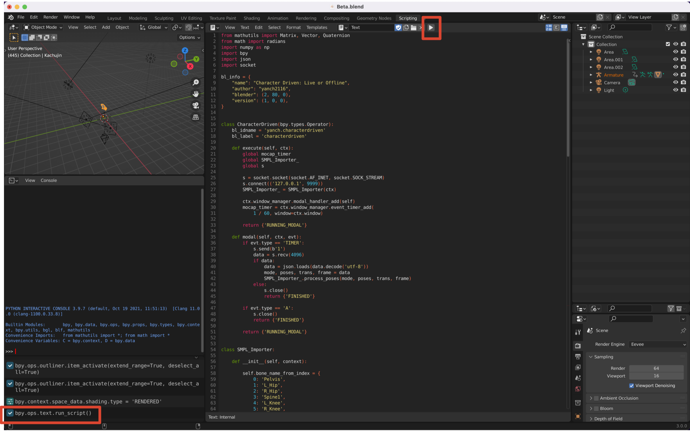
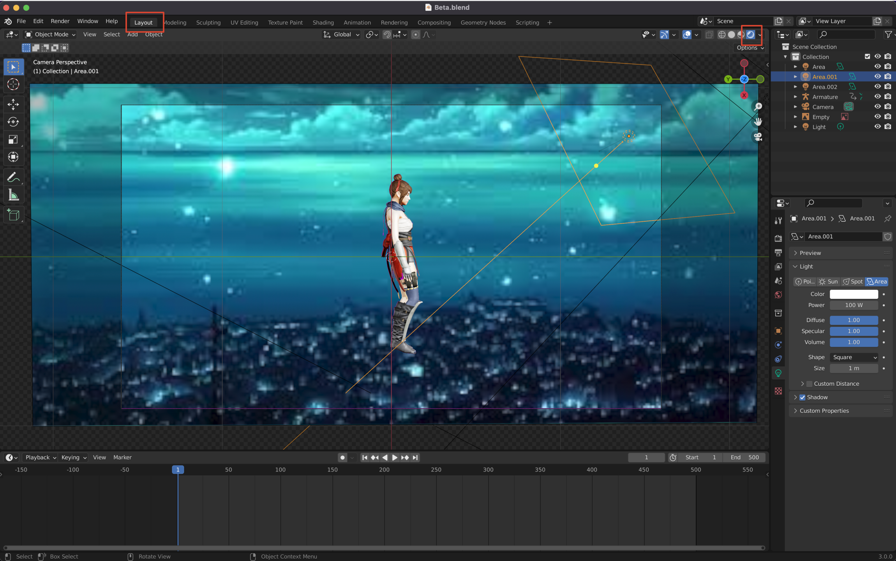
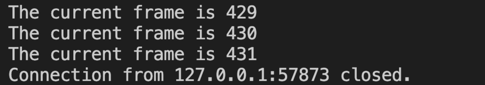
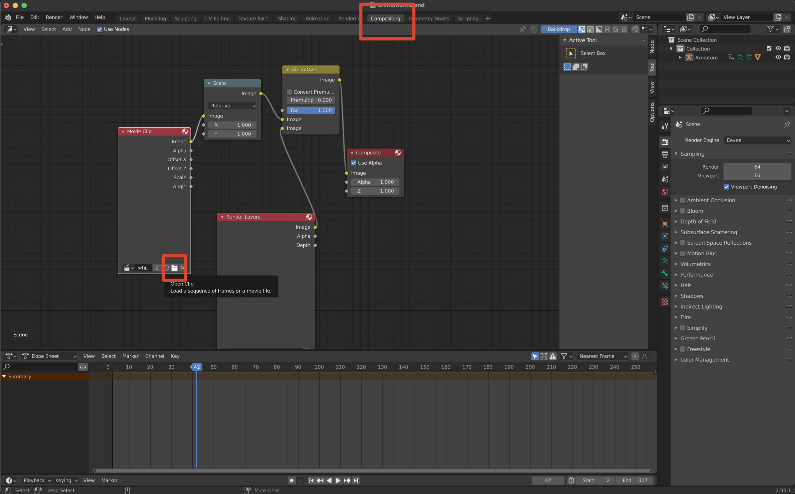

[English](README.md)｜[中](README.zh_CN.md)

# Blender addon for driving character

The addon drives a 3D cartoon character by transferring SMPL's pose and global translation into the skeleton of the 3D character. Poses and global translation can be obtained from RGB images using ROMP or any SMPL-based 3D pose estimation model. If the estimation model outputs pose and global position at a high speed, then you can achieve the effect of driving 3D characters in real time in Blender.

## Two Pipeline

### From Video to Animation

Steps:

1. Modify the path of [results.npz](demo/results.npz) in [server.py](src/server.py) and start server.py in the command line.
2. Open [Beta.blend](blender/Beta.blend) and click on the triangle in the upper right corner.If a message is displayed in the lower left corner, the addon is running successfully.
   
3. Go back to the Layout view and click on the small icon in the upper right to get the Texture.
   
4. Press Ctrl+E to run the addon. At this time, the keyframe that is being transferred is displayed in the command line running server.py.
   
5. Press the space in Blender to view the character animation.

> If you want to use your own video, you need to use [ROMP](https://github.com/Arthur151/ROMP)'s [video.sh](https://github.com/Arthur151/ROMP/blob/master/scripts/video.sh) to get a npz file.

### The Webcam Drive Character in Real-Time

Steps:

1. Connect the camera and run ROMP's [webcam_blender.sh](https://github.com/Arthur151/ROMP/blob/master/scripts/webcam_blender.sh).
2. The rest of the steps are the same as steps 2, 3 of `From Video to Animation`, where the 3D characters in Blender are driven in real time by pressing Ctrl+E.Press A to stop it.

## Use Your Own 3D Character

If you are familiar with Blender and you want to use your own 3D characters, make sure that the skeleton is exactly the same as the SMPL's skeleton and that the bones are named the same as the bones of my 3D characters (of course, you can also change the bone names in the addon). All the 24 bones in SMPL need to be named the same. There is no need to change the name of the finger bones.

## Use Your Own Background

If you need a video background in the demo, select Compositing in the top menu bar, click Open Clip in the Movie Clip, and select your video.It is best not to use video as a background when driving in real time to prevent animations from getting too stuck.

## Acknowledgement

- 3D character is downloaded from [Mixamo](https://www.mixamo.com/#/)
- [Blender 2.8](https://www.bilibili.com/video/BV1T4411N7GE?spm_id_from=333.999.0.0)
- [Blender Manual](https://docs.blender.org/manual/en/latest/)
- [Blender Python API](https://docs.blender.org/api/current/index.html)
- [neuron_mocap_live-blender](https://github.com/pnmocap/neuron_mocap_live-blender)
- [QuickMocap-BlenderAddon](https://github.com/vltmedia/QuickMocap-BlenderAddon)
- [remote-opencv-streaming-live-video](https://github.com/rena2damas/remote-opencv-streaming-live-video)
