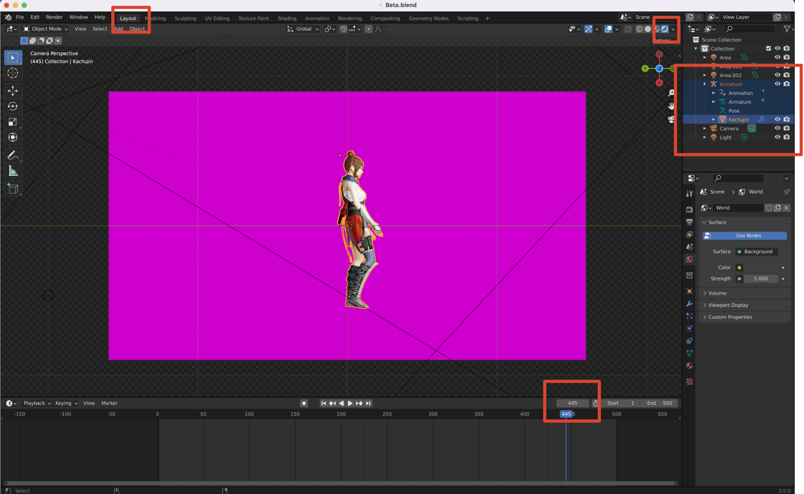
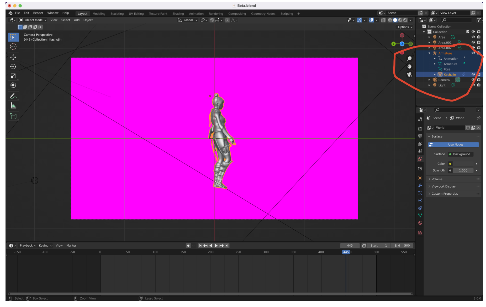

[English](README.md)｜[中](README.zh_CN.md) 
# 驱动3D人物的Blender插件

该插件通过传输SMPL的姿态和全局位置到3D人物的骨架中来驱动3D卡通人物。姿态和全局位置可以通过ROMP或者任意基于SMPL的3D姿态估计模型从RGB图像中获得。如果估计模型能够以较高速度输出姿态和全局位置，那么就能够在Blender中实现实时驱动3D人物的效果。

## 两种流程

### 从视频到动画

使用示例：

1. 修改[server.py](src/server.py)中的[demo1.npy](demo/demo1.npy)路径，并在命令行启动server.py
2. 打开[Beta.blend](blender/Beta.blend)，并点击右上角三角，看到左下角提示，说明插件运行成功

  

3. 回到layout视图，点击右上角小图标获取Texture，将右下角视频关键帧调整至1，将右边元素列表按住Shift选中Armature及其子元素

  

4. 按下Ctrl+E运行插件，此时在运行server.py的命令行中会提示当前正在传输的关键帧，传输结束后连接断开

 

5. 在Blender中按下空格键即可观看到人物动画

如果你想要使用自己的视频，你需要使用ROMP的[video.sh](https://github.com/Arthur151/ROMP/blob/master/scripts/video.sh)脚本获取npz文件，并将npz文件中的数据格式根据[数据格式](#数据格式)调整好，再进行传输。

### 从摄像头到动画

The first demo uses ROMP outputs from the video, which is stored in a file.

The second demo uses ROMP outputs from the webcam in real-time.

The 3D character is downloaded from [Mixamo](https://www.mixamo.com/#/).

##

## How to Use the [add-on](src/characterDriven.py)

### Data Requester

This addon is a data requester that sends a data request over TCP to `127.0.0.1:9999`.It gets one data at a time from the data server.

After running the addon by pressing ctrl+E in Blender, it keeps asking for data until the server closes the TCP connection. You can also press A to close the TCP connection.

### Data Server

The data server is bound to `127.0.0.1:9999`. After receiving a request from the data requester, one data is sent to the requester.

I've written [server.py](src/server.py) as a example data server (you only need to know a little about Python TCP to understand it).

Real-time data server can be found in [ROMP](https://github.com/Arthur151/ROMP).You just need to run [webcam_blender.sh](https://github.com/Arthur151/ROMP/blob/master/scripts/webcam_blender.sh).

### 数据格式

The data is a Python list of four elements in the form of `[mode,poses,global translation,current keyframe id]`.

1. Mode is an integer, 1 for insert keyframe, 0 for no insert keyframe. Insert keyframes and animation rendering can be carried out later. Keyframes are generally not inserted in real-time mode to make real-time driving cartoon characters smoother.
2. Poses is a list of length 72.
3. Global translation is a list of length 3. If you don't need global translation, just go into [0,0,0].
4. Current keyframe id is an integer.If you insert keyframes, you should set it to the correct keyframe id. If you don't insert keyframes, just set it to 0.

### Steps

1. Install the addon in Blender
2. Run data server
3. Press Ctrl+E in Blender to run addon
4. Press A in Blender to stop addon or wait until the data transfer is complete

> In step 3, you'd better make Armature active, otherwise bugs may occur (key "Pelvis" not found'). Also, the mouse must be placed in the 3D viewport area(where the 3d model is), otherwise the addon will not run.

## Something about Blender

If you're not familiar with Blender, I've upload a [blender project](/blender/Beta.blend) to help you.All you need to do is open it and follow [Steps](#steps) to achieve the effect shown in the Demo.(It's better to know something about [animation](https://www.bilibili.com/video/BV1zh411Y7LX?from=search&seid=4554151926894860198&spm_id_from=333.337.0.0) in Blender.)

If you need a video background in the demo, select Compositing in the top menu bar, click Open Clip in the Movie Clip, and select your video.

If you are familiar with Blender and want to use your own model, you should make sure it's armature is SMPL's skeleton. The armature should name Armature and each bone has the same name as the bones in [demo model](blender/Alpha.fbx)(Only the 24 bones of SMPL skeleton are needed, and the fingers don't need to change their names).

## Useful Resources

- [Mixamo](https://www.mixamo.com/#/)
- [Blender 2.8](https://www.bilibili.com/video/BV1T4411N7GE?spm_id_from=333.999.0.0)
- [Blender 2.9-3.0](https://www.bilibili.com/video/BV1zh411Y7LX?from=search&seid=12526205672689328022&spm_id_from=333.337.0.0)
- [Blender Manual](https://docs.blender.org/manual/en/latest/)
- [Blender Python API](https://docs.blender.org/api/current/index.html)
- [neuron_mocap_live-blender](https://github.com/pnmocap/neuron_mocap_live-blender)
- [QuickMocap-BlenderAddon](https://github.com/vltmedia/QuickMocap-BlenderAddon)
- [remote-opencv-streaming-live-video](https://github.com/rena2damas/remote-opencv-streaming-live-video)
