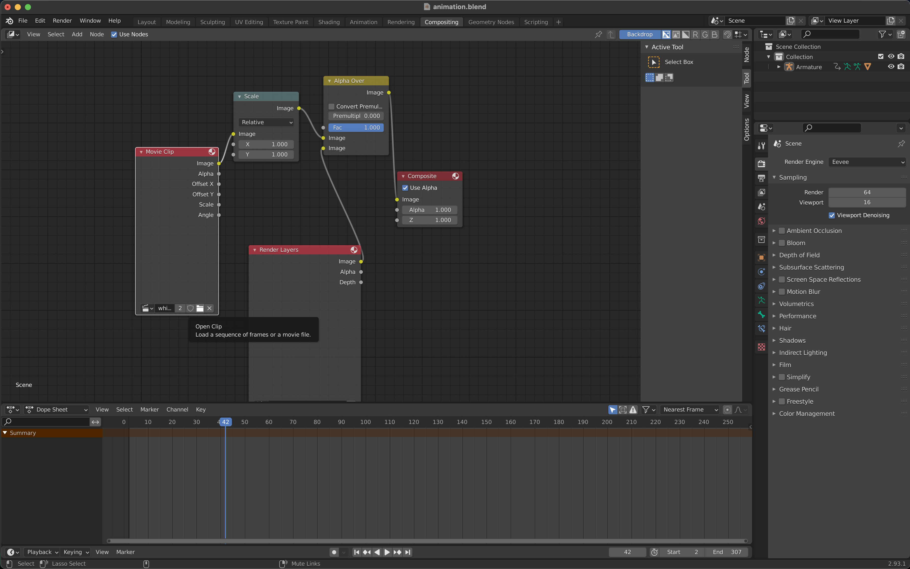
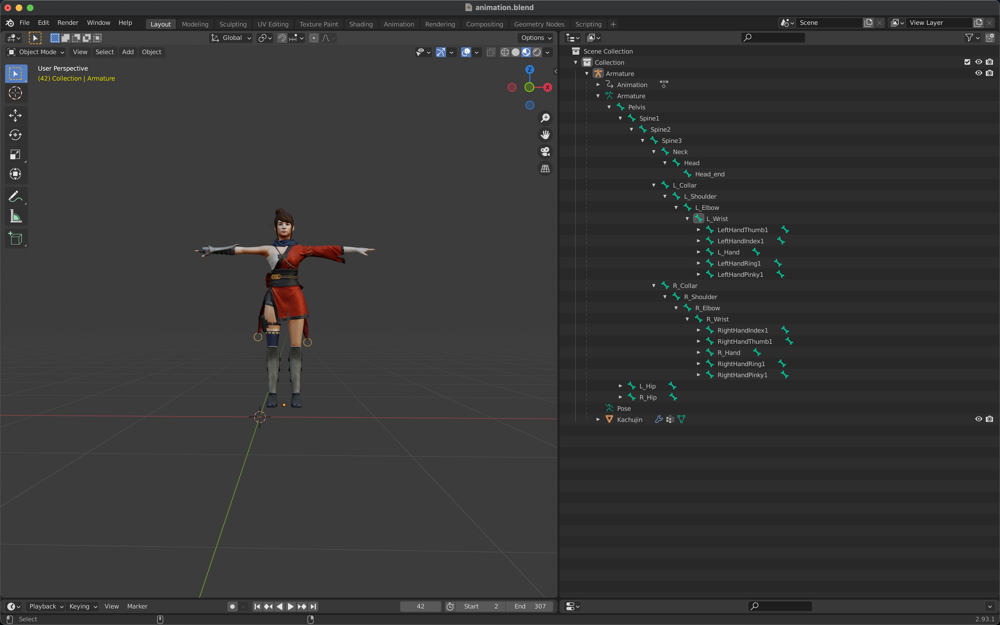

# Blender addon for driving character

## Demo

The first demo uses ROMP outputs from the video, which is stored in a .npz file (or any dictionary file, such as .npy or .pkl).

The second demo uses ROMP outputs from the webcam.

## How to Use the [add-on](/src/characterDriven.py)

### Data

The data is a Python list of four elements in the form of `[mode,poses,global translation,current keyframe id]`. Pose and global translation are output by ROMP, or any other 3D pose Estimation model.

1. Mode is an integer, 1 for insert keyframe, 0 for no insert keyframe. Insert keyframes and animation rendering can be carried out later. Keyframes are generally not inserted in real-time mode to make real-time driving of cartoon characters smoother.
2. Poses is a list of length 72.
3. Global translation is a list of length 3. If you don't need global translation, just go into [0,0,0].
4. Current keyframe id is an integer,which represents the keyframe of the current poses, specifying it if you insert keyframes. If you don't insert keyframes, just set it to 0.

### Data Requester

This addon is a data requester that sends a data request over TCP to `127.0.0.1:9999`.It gets one data at a time from the server.

After running the addon by pressing ctrl+E in Blender, it keeps asking for data until the server closes the TCP connection. If you find any errors, you can also press A to close the TCP connection.

### Data Server

The data server is bound to `127.0.0.1:9999`. After receiving a request from the data requester, data is continuously sent to the requester.

I've written [server.py](https://github.com/yanch2116/CharacterDriven-BlenderAddon/blob/master/src/server.py) as a example data server (you only need to know a little about Python TCP to understand it).

Real-time data server can be found in [ROMP](https://github.com/Arthur151/ROMP).You just need to run [webcam_blender.sh](https://github.com/Arthur151/ROMP/blob/master/scripts/webcam_blender.sh).

### Steps

1. Install the addon in Blender
2. Run data server
3. Press Ctrl+E in Blender to run addon
4. Press A in Blender to stop addon or wait until the data transfer is complete

> In step 3, you'd better select `Armature`, otherwise bugs may occur. Also, the mouse must be placed in the 3D viewport area(where the model is), otherwise the addon will not run.
## Something about Blender

If you're not familiar with Blender, I've placed a [blender project](https://github.com/yanch2116/CharacterDriven-BlenderAddon/blob/master/resources/animation.blend) in the resources folder to help you.All you need to do is open it and follow [Steps](#steps) to achieve the effect shown in the Demo.(It's better to know something about animation in Blender.)

If you need a video background in the demo, select Compositing in the top menu bar, click Open Clip in the Movie Clip, and select your video.

If you are familiar with Blender and want to use your own models, you should make sure it's armature is SMPL skeleton. The armature should name `Armature` and each bone has the same name as the bones in [demo model](https://github.com/yanch2116/CharacterDriven-BlenderAddon/blob/master/resources/Alpha.fbx)(Only the 24 bones of SMPL skeleton are needed, and the fingers don't need to change their names).

